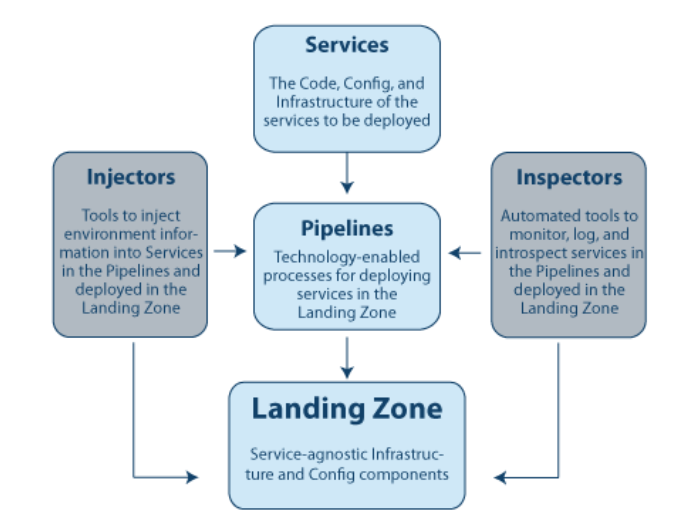
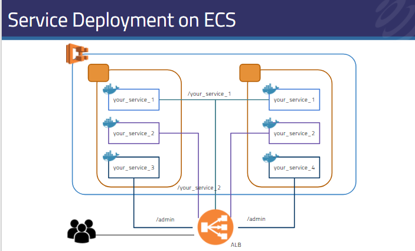

#QuickStart ECS-WORKSHOP-LANDING-ZONE

This repository can be used to create a pipeline which will deploy the whole AWS architecture for creating the
ECS-Workshop-Landing-Zone in any AWS account.The pipeline created by this repo will create the product for each
template which are present in cf-templates folder present in the ECS-Workshop-Service repo.Inside the ecs-workshop
pipeline we have diff-diff pipeline stages which basically create the stacks for diff tasks, so if we want to update
s stage we can do it by just updating the particular stack or by updating whole pipeline.

The main purpose of ecs-wirkshop pipeline is to create the portfolio for ecs-workshop and then create
the product for all templates available in ecs-service repo 's cf-templates like common/microservices.yml
This pipeline uses the micro-service architecture for creating the all stages and stacks.
 
### Architecture Of  ECS-Workshop-Landing-Zone

###Prerequisites 
For create the ecs-workshop-pipeline we need to deploy the lz-pipeline.yml but before deploying this template
we need to specify the parameter values in the config file of each respective child template.like we need to 
specify the parameters in config_params.json file present in each product so they can be used as template 
parameters.

We need to specify the template parameters in following files inside cf-templates folder:

* For ecs-cluster stage inside ecs-cluster/config_params.json.
* For iam stage inside iam/config_params.json.
* For network stage inside network/config_params.json.
* For service manager stage inside service/config_params.json.

###Diagram of ecs-workshop pipeline:

### Diagram of ecs-landing-zone-cluster :

### Diagram of service deployment on ecs:

### Landing zone and service repo template organization:

 

 

