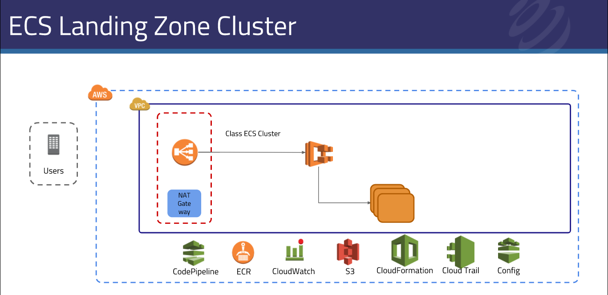
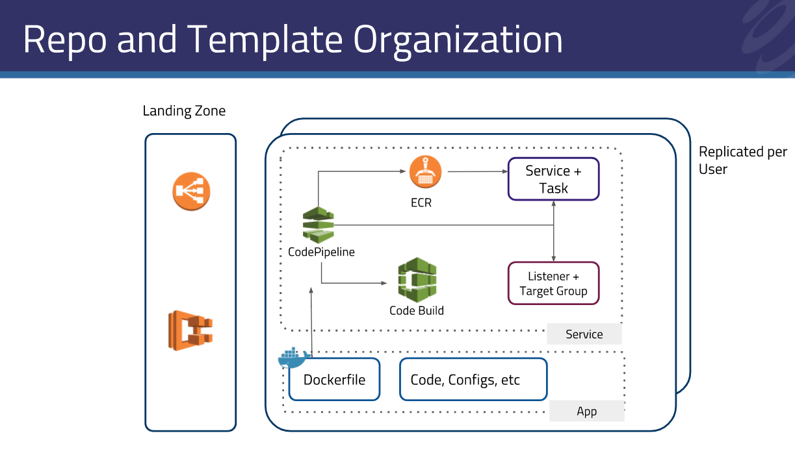

# QuickStart ECS-WORKSHOP-LANDING-ZONE

This repository can be used to create a pipeline which will deploy the whole AWS architecture for 
creating the ECS-Workshop-Landing-Zone in any AWS account.The pipeline created by this repo will 
create the project in code build so we can build products for diff services present in cf-templates folder 
present in the [ECS-Workshop-Service repo](https://github.com/Flux7Labs/ecs-workshop-service).Inside the 
ecs-workshop pipeline we have diff-diff pipeline stages which basically create the stacks for 
diff tasks, so if we want to updates stage we can do it by just updating the particular stack 
or by updating whole pipeline.

The main purpose of ecs-wirkshop pipeline is to create the portfolio for ecs-workshop and then create
the product for all templates available in ecs-service repo 's cf-templates like common/microservices.yml
This pipeline uses the micro-service architecture for creating the all stages and stacks.
 
## Architecture Of  ECS-Workshop-Landing-Zone

## Prerequisites 

* We need to implement the git2s3 stack first.

**Git2S3**:
    
This stack creates webhook endpoints and deploys an AWS Lambda function to push
your code to Amazon S3 and linking our Git Repository to Amazon S3 and AWS services for continuous code 
integration,testing, and deployment.To read about it more visit [git2s3](https://github.com/aws-quickstart/quickstart-git2s3).
     
This stack basically integrate AWS S3 bucket to our github repo using http endpoints so whenever
the code is updated in github repo so git webhooks will trigger lambda function which will put the updated files to 
the output S3 bucket specified in git2s3 stack parameters. 
 
 
 
After deploying the git2s3 stack in same region where the pipeline is deployed then we need to configure
our Git repo.We need to create a webhook in our git repo to which we want to deploy in our case it is 
[ecs-workshop-lz](https://github.com/Flux7Labs/ecs-workshop-lz).In this webhook we need to provide the payload
url.After deploying the git2s3 stack we get output also in output tab.In output tab we will get two api endpoints
so copy the api endpoint from output tab acc to our use to the payload url.
 
Now if we update our Ecs-workshop-landing-zone repo then it will create zip of our repo and upload only that part
that is updated.  

* We need to create a key-pair for ecs cluster instance in same account and region.
 
* For create the ecs-workshop-pipeline we need to deploy the lz-pipeline.yml but before deploying this template
  we need to specify the parameter values in the config file of each respective child template.like we need to 
  specify the parameters in config_params.json file present in each product so they can be used as template 
  parameters.

We need to specify the template parameters in following files inside cf-templates folder:

* For ecs-cluster stage inside ecs-cluster/config_params.json.
* For iam stage inside iam/config_params.json.
* For network stage inside network/config_params.json.
* For service manager stage inside service/config_params.json.

* StackPrefix 's value in all config_params.json must be smaller than 30 characters.
* ServiceTemplateBucketName,ServiceArtifactBucketName,ServiceResourceBucketName
  ArtifactBucketName  must be unique because they will be created by service manager stack.
* We need to get the latest AMI id for the ecs optimized AMI and then specify it in ecs-cluster/config_params.json file.  

## ECS-Workshop pipeline with all stages:

### FetchFromGitHub Stage:
    
This stage is used by pipeline to fetch the zip of git repo from oupout S3 bucket which is create by git2s3 stack
ans this zip file is used by the codepipeline to get child template for create pipeline stages.
    
### IAMStackDeploy:
    
This stage is used by pipeline to deploy IAM satck which will create cloudformation and  ECS service role for landing zone
and also create a change set so if any change is detected by pipeline so pipeline can update the iam deploy stack.

### NetworkStackDeploy:
    
This stage is used by pipeline to deploy the network stack which will create the vpc,private and public subnets,firewall
,internet gateway,nat gateway,network acl and other networking related stuff for landing zone and also create
a network execute change set so if any change is detected by pipeline so pipeline can update the network deploy stack.

### ECSDeployStack:

This stage is used by pipeline to deploy the ECS cluster using docker container image for the landing
zone.This ECS cluster is used by code build to build our project so on every build code build will 
launch a container for build our project.also create a ecs execute change set so if any change is detected 
by pipeline so pipeline can update the ecs deploy stack.

### CreateServiceChangeSetExecution

This stage is used by pipeline to deploy service manager stack which will deploy the service manager iam role
, our build project in code build and service manager pipeline in code pipeline.
## Diagram of service deployment on ecs:

## Landing zone and service repo template organization:

 

 

